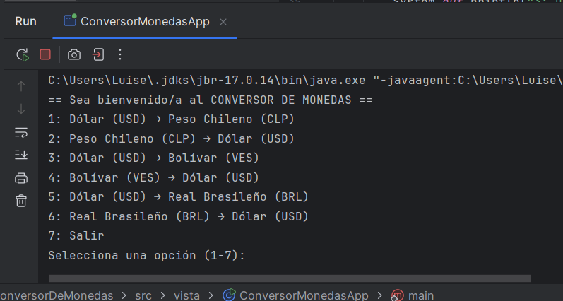
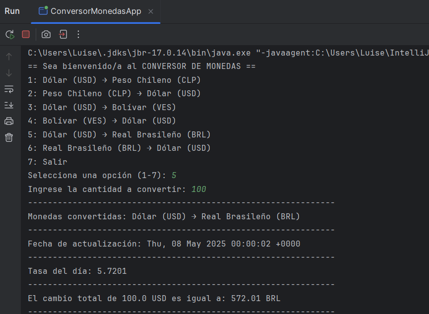
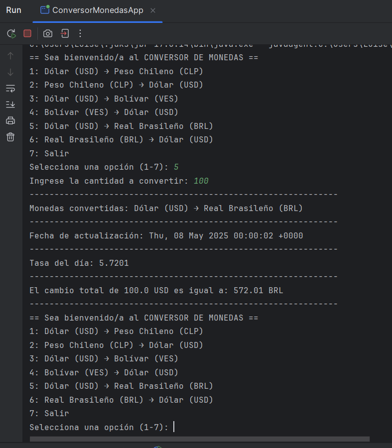
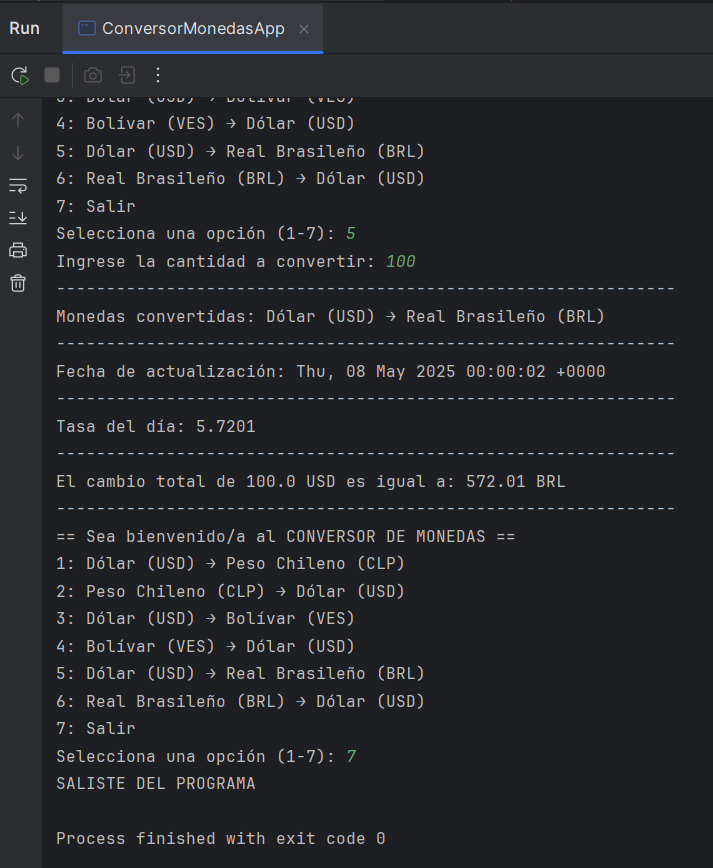

# 💱 Convertidor de Monedas

Esta aplicación permite convertir entre diferentes monedas usando tasas de cambio actualizada desde una API externa.

## 🚀 Funcionalidades

- ✅ Conversión entre distintas monedas (USD, CLP, VES, BRL.)
- ✅ Toma los datos en tiempo real desde una API de tasas de cambio
- ✅ Diseño sencillo e intuitivo
- ✅ Validación de entrada del usuario

## Capturas de pantalla

### 🧭 Menú principal
Muestra el menú con las opciones para seleccionar la conversión de moneda.

### 💰 Resultado de la conversión
Ejemplo de cómo se muestra la cantidad convertida, la tasa de cambio y los detalles de la operación.

### 🔁 Repetición del menú tras una conversión

Después de realizar una operación, el programa vuelve a mostrar el menú de opciones para permitir nuevas conversiones.

### 🛑 Finalización del programa

Cuando el usuario elige la opción de salir, el programa finaliza su ejecución de forma ordenada.

